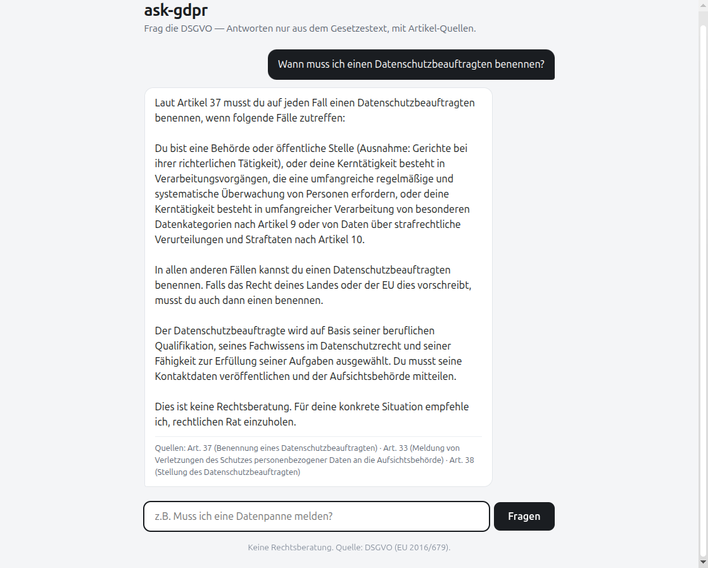
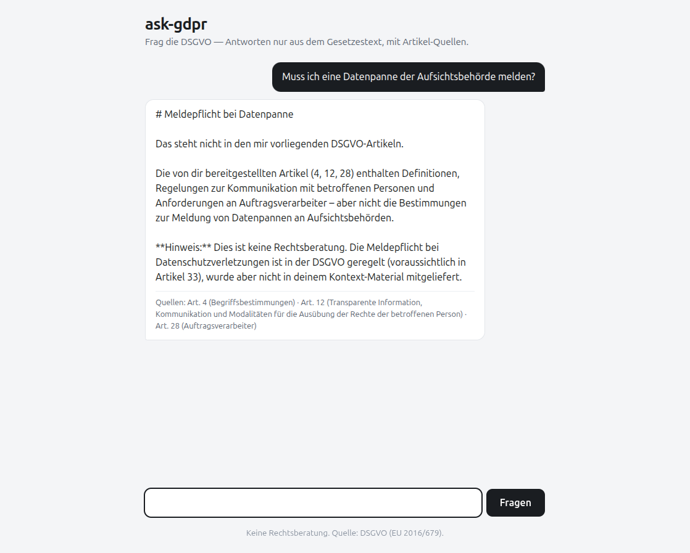

# ask-gdpr

Ask the GDPR questions in German. A staged RAG (Retrieval-Augmented Generation) app
that retrieves the most relevant GDPR articles and lets Claude answer **only** from
them — with article citations and a retrieval eval suite from day 1.



When retrieval misses, the guardrail kicks in instead of hallucinating:



## Why this architecture

This is portfolio project #1 of my AI developer track. The architecture is deliberately
staged: v1 is fully explainable in an interview, and each version upgrade is measured
against the same eval set.

| Decision | Choice | Why |
|---|---|---|
| Retrieval v1 | Keyword scoring (lowercased word overlap) | Simple, transparent baseline. Its measured weaknesses (German inflection, synonyms) are the motivation for v2 embeddings — with numbers to prove the improvement. |
| Corpus | GDPR, all 99 articles (German) | Public domain, cleanly structured into natural chunks, no privacy issues in a public repo. |
| LLM | Claude Haiku 4.5 (`claude-haiku-4-5`) | Cheap and fast; grounded answering from provided context doesn't need a bigger model. Cost capped via `max_tokens`. |
| Guardrail | System prompt: answer ONLY from the provided articles, cite article numbers, refuse otherwise | Anti-hallucination. The refusal path is tested and visible in the demo above. |
| Evals | Retrieval hit-rate (expected article in top-3), 30 questions | Measuring quality from day 1. The eval set includes colloquial questions that are *expected* to fail in v1 — that's the honest baseline. |
| No deployment (yet) | Local only | A public deployment would spend my API key on strangers. Live deploy with rate limiting is a later milestone. |

## How it works

```
question (German)
   │
   ▼
retrieval.search()        scores all 99 articles by keyword overlap, returns top 3
   │                      (returns nothing relevant → answer "not found", NO API call)
   ▼
claude_client.ask_claude()  builds a grounded prompt with the 3 article texts
   │
   ▼
Claude Haiku              answers in German, citing article numbers — or refuses
   │
   ▼
UI                        shows the answer + source article chips
```

## Evals

`evals/run_evals.py` checks for 30 questions whether an expected article appears in
the retrieval top-3.

**v1 baseline: 19/30 = 63% hit-rate.**

The misses are the interesting part:

- **German inflection:** "Datenpanne **melden**" doesn't match "**Meldung** einer Verletzung" (Art. 33) — keyword overlap can't stem.
- **Synonyms / colloquial language:** "Cookie-Banner", "Newsletter", "gehackt" don't appear in legal text at all.

These failures are kept in the eval set on purpose. v2 (embeddings) will run against
the **same 30 questions**, so the improvement is measurable, not vibes.

## Run it

```bash
python3 -m venv .venv
.venv/bin/pip install -r requirements.txt
cp .env.example .env        # add your ANTHROPIC_API_KEY
.venv/bin/python app.py     # → http://localhost:5000

.venv/bin/python -m pytest          # 17 tests
.venv/bin/python evals/run_evals.py # retrieval hit-rate table
```

The GDPR dataset (`data/gdpr_articles.json`) is committed, so the app needs no
network access at runtime. To rebuild it: `.venv/bin/python scripts/build_dataset.py`.

## Roadmap

| Version | What | Status |
|---|---|---|
| **v1** | Keyword retrieval + grounded Claude answers + eval baseline + chat UI | ✅ this repo |
| v2 | Embeddings + cosine similarity (in-memory), eval comparison v1 vs. v2 | planned |
| v3 | pgvector/Supabase, promptfoo evals, PDF upload for your own documents | planned |
| later | Live deployment with rate limiting | planned |

## Privacy

The GDPR app practices what it preaches: no user data stored, no cookies, no
tracking, no external fonts or CDNs — fully self-contained.

## Disclaimer

Not legal advice. Answers are generated from the GDPR text and can be incomplete
or wrong — always consult a professional for real legal questions.
